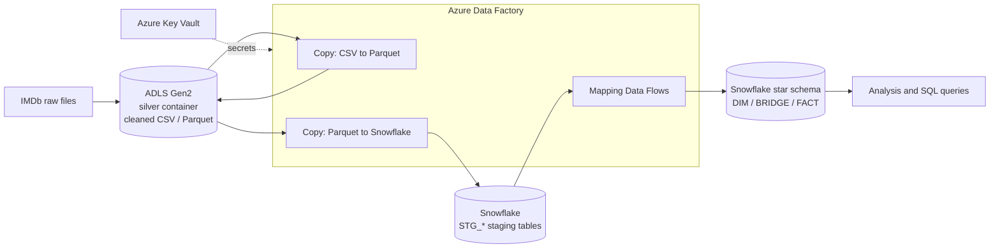
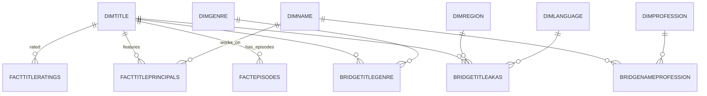

# IMDb Data Engineering and Analysis Project

## Overview

This project builds an end-to-end ELT pipeline on Azure that takes the public IMDb datasets from raw files to an analytics-ready dimensional model in Snowflake. Cleaned files in Azure Data Lake Storage are loaded into Snowflake staging tables with Azure Data Factory, then transformed with Mapping Data Flows into a star schema of dimension, bridge and fact tables that can answer questions about titles, ratings, genres, people, regions and languages.

## Project Goals

1. **Data Ingestion:** Move cleaned IMDb files (CSV and Parquet) from the data lake into Snowflake in a repeatable way.
2. **Format Conversion:** Convert CSV to Parquet inside the pipeline for smaller, faster, columnar loads.
3. **Staging Layer:** Land every source as-is in Snowflake `STG_*` tables so transformations never touch the raw files directly.
4. **Normalization:** Break multi-valued fields (genres, professions, directors, writers) into one row per value.
5. **Dimensional Modeling:** Build dimensions, bridge tables and facts with surrogate keys, so many-to-many relationships are modeled correctly.
6. **Incremental Loads and Auditability:** Generate new surrogate keys on top of the current maximum key, and stamp every row with a job ID and load date.
7. **Security:** Keep credentials out of pipeline code using Azure Key Vault and a managed identity.

## Services Used

1. **Azure Data Lake Storage Gen2:** Central storage for the dataset. Cleaned files live in the `silver` container.
2. **Azure Blob Storage:** Additional storage account used for file staging.
3. **Azure Data Factory:** Orchestrates everything. Copy activities handle CSV to Parquet conversion and bulk loads into Snowflake; Mapping Data Flows handle the transformations.
4. **Azure Key Vault:** Stores connection secrets, accessed by Data Factory through its system-assigned managed identity.
5. **Snowflake:** Cloud data warehouse that holds both the staging tables and the final star schema (`IMDB_DB.IMDB_SCHEMA`).
6. **Git integration:** The Data Factory is connected to this repository, with published ARM templates going to the `adf_publish` branch.

## Dataset Used

The IMDb Non-Commercial Datasets are a set of files IMDb refreshes daily for personal and non-commercial use. Each file covers one part of the catalog, and records are linked by `tconst` (title ID) and `nconst` (person ID).

| File | What it contains |
| --- | --- |
| `title.basics` | Title type, primary and original title, adult flag, start and end year, runtime, genres |
| `title.akas` | Alternate titles by region and language |
| `title.crew` | Directors and writers for each title |
| `title.episode` | Season and episode numbers, linked to the parent series |
| `title.principals` | Principal cast and crew, with category, job and character |
| `title.ratings` | Average rating and number of votes |
| `name.basics` | People, with birth and death year, primary professions and known-for titles |

Two lookup files enrich the model: a country code list (for regions) and an ISO language code list (for languages).

https://developer.imdb.com/non-commercial-datasets/

## Architecture Diagram



## Pipeline Flow

**1. Staging load.** Copy activities read cleaned files from the `silver` container and write them to Snowflake staging tables. The `csv_parquet` pipeline chains two steps: it converts `title_ratings_cleaned1.csv` to Parquet, then loads the Parquet file into Snowflake.

**2. Flattening.** Data flows split comma-separated columns and unroll them into separate rows:
- `GENRES` in title basics (one row per title and genre)
- `PRIMARYPROFESSION` in name basics (one row per person and profession)
- `DIRECTORS` and `WRITERS` in title crew

**3. Cleaning.** Missing values such as `\N` or empty genres are replaced with `unknown`, and special characters are stripped from language names with a regex.

**4. Dimension, bridge and fact loads.** Each data flow follows the same pattern:
1. Read the staging table.
2. Read the current maximum surrogate key from the target table (`NVL(MAX(key), 0)`).
3. Cross join the two, then aggregate to remove duplicates.
4. Generate a row number and add it to the maximum key to create new surrogate keys.
5. Look up or join to dimensions to resolve foreign keys, defaulting missing keys to `0`.
6. Add audit columns `DI_JOB_ID` (a pipeline parameter) and `DI_CREATED_DT`.
7. Insert into the target table.

## Data Model

| Table | Type | Grain |
| --- | --- | --- |
| `DIMTITLE` | Dimension | One row per title |
| `DIMNAME` | Dimension | One row per person |
| `DIMGENRE` | Dimension | One row per genre |
| `DIMPROFESSION` | Dimension | One row per profession |
| `DIMREGION` | Dimension | One row per country or region |
| `DIMLANGUAGE` | Dimension | One row per language |
| `BRIDGETITLEGENRE` | Bridge | Title to genre |
| `BRIDGENAMEPROFESSION` | Bridge | Person to profession |
| `BRIDGETITLEAKAS` | Bridge | Title to alternate title, with region and language |
| `FACTTITLERATINGS` | Fact | Rating and vote count per title |
| `FACTTITLEPRINCIPALS` | Fact | Person's role on a title |
| `FACTEPISODES` | Fact | Episode linked to its parent series |



## Repository Structure

```
IMDB_DATA_ENGINEERING_AND_ANALYSIS/
├── dataflow/        # Mapping Data Flows: flattening, cleaning, DIM, BRIDGE and FACT loads
├── dataset/         # Dataset definitions for ADLS files and Snowflake tables
├── linkedService/   # Connections to ADLS, Blob Storage, Key Vault and Snowflake
├── pipeline/        # Pipelines that run the copy activities and data flows
├── factory/         # Data Factory instance definitions
└── publish_config.json
```

## Example Queries

Once the model is loaded, questions like these can be answered directly in Snowflake:

```sql
-- Top rated genres (titles with at least 10,000 votes)
SELECT g.GENRES, ROUND(AVG(TRY_TO_DOUBLE(r.AVERAGERATING)), 2) AS avg_rating, COUNT(*) AS titles
FROM IMDB_SCHEMA.FACTTITLERATINGS r
JOIN IMDB_SCHEMA.BRIDGETITLEGENRE b ON r.TITLEKEY = b.TITLEKEY
JOIN IMDB_SCHEMA.DIMGENRE g        ON b.GENREKEY = g.GENREKEY
WHERE TRY_TO_NUMBER(r.NUMVOTES) >= 10000
GROUP BY g.GENRES
ORDER BY avg_rating DESC;

-- Regions with the most alternate titles
SELECT d.COUNTRY_NAME, COUNT(*) AS alt_titles
FROM IMDB_SCHEMA.BRIDGETITLEAKAS a
JOIN IMDB_SCHEMA.DIMREGION d ON a.REGIONKEY = d.REGIONKEY
GROUP BY d.COUNTRY_NAME
ORDER BY alt_titles DESC
LIMIT 10;
```

## How to Deploy

1. Create an Azure Data Factory, an ADLS Gen2 account with a `silver` container, a Key Vault and a Snowflake account with a database `IMDB_DB` and schema `IMDB_SCHEMA`.
2. Upload the cleaned IMDb files and lookup files to the `silver` container.
3. Connect the Data Factory to this repository (Manage > Git configuration).
4. Update the linked services with your own storage URLs, Key Vault and Snowflake account, keeping secrets in Key Vault.
5. Create the staging and target tables in Snowflake.
6. Run the pipelines in order: staging loads, flattening, dimensions, bridges, then facts.
